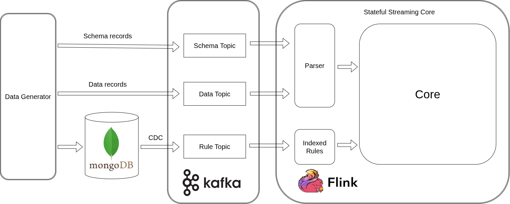

# Đặc Tả Hệ Thống Stateful Streaming Core

---

## 1. Tổng Quan Hệ Thống

### 1.1 Giới Thiệu
Hệ thống là một **Core xử lý luồng dữ liệu thời gian thực có trạng thái** phát triển trên nền **Apache Flink**. Đây là lớp lõi hạ tầng dùng chung cho mọi bài toán cần tính toán liên tục trên dòng sự kiện vô hạn, hoàn toàn độc lập với miền nghiệp vụ cụ thể.

Bài toán **Phân khúc khách hàng thời gian thực (CDP - Customer Data Platform)** được lựa chọn làm ca kiểm chứng vì hội tụ đầy đủ các đặc trưng kỹ thuật phức tạp:
- Lưu lượng sự kiện đầu vào cực lớn.
- Các chỉ số tổng hợp theo cửa sổ thời gian cho hàng triệu khách hàng độc lập.
- Tiêu chí phân khúc/luật đánh giá thay đổi liên tục theo chiến dịch do người dùng nghiệp vụ định nghĩa.
- Yêu cầu độ trễ tính toán khắt khe tính bằng millisecond/giây.

---

### 1.2 Vấn Đề Giải Quyết

Hệ thống tập trung giải quyết triệt để 4 bài toán kỹ thuật cốt lõi:

1. **Tính toán tổng hợp có trạng thái theo cửa sổ thời gian**:
   - Duy trì các chỉ số dạng Tổng (`SUM`), Đếm (`COUNT`), Trung bình (`AVG`), Lớn nhất (`MAX`), Nhỏ nhất (`MIN`) trong $N$ đơn vị thời gian gần nhất cho hàng triệu thực thể độc lập (`customer_id`).
   - Cập nhật tăng dần theo từng sự kiện đến, đảm bảo bộ nhớ hữu hạn và tự động dọn dẹp dữ liệu hết hạn.

2. **Thay đổi logic tính toán khi hệ thống đang chạy**:
   - Toàn bộ công thức tổng hợp và luật đánh giá được mô tả bằng dữ liệu thay vì mã hóa cứng.
   - Áp dụng cấu hình mới trên toàn cụm Flink đang chạy trong vài giây mà không cần biên dịch lại hay khởi động lại job streaming.

3. **Chọn lọc nhanh ở quy mô cực lớn**:
   - Khi số định nghĩa tính toán ($N$) và số luật ($M$) lên tới hàng triệu, hệ thống sử dụng cấu trúc chỉ mục nghịch đảo dựa trên tần suất xuất hiện điều kiện.
   - Chọn 2 trường hiếm nhất làm trục chỉ mục chính và dùng phép giao 2 tập ứng viên để loại bỏ phần lớn các rule không liên quan với chi phí tính toán gần như hằng số $O(1)$.

4. **Đảm bảo tính đúng đắn khi có sự cố**:
   - Xử lý chính xác dữ liệu đến trễ, đến không đúng thứ tự, node chết giữa chừng, hoặc cấu hình đến sau sự kiện.
   - Bảo đảm kết quả nhất quán tuyệt đối và khôi phục trạng thái hoàn hảo mà không làm mất hoặc lặp dữ liệu.

---

## 2. Phạm Vi Dự Án

### 2.1 Tính Năng Hỗ Trợ

- **Phân tách 2 cấp điều kiện trong Rule**:
  - **1. Điều kiện kích hoạt (`trigger_criteria`)**: Bộ lọc cửa ngõ dựa trên `(source, version)` và mảng 2D `conditions`. Một bản tin event đến bắt buộc phải thỏa mãn điều kiện trigger này trước thì mới được phép đi vào xử lý sâu hơn.
  - **2. Điều kiện lõi của Rule (`condition_tree`)**: Logic đánh giá chính của rule (kết hợp dữ liệu cửa sổ Ring Buffer, thuộc tính thô và biểu thức tuyến tính). Chỉ khi event đến vượt qua `trigger_criteria`, Core mới tiến hành kiểm tra `condition_tree` đối với `customer_id` tương ứng của event đó.
- **Cửa sổ tổng hợp Ring Buffer**:
  - 2 loại cửa sổ: Sliding Window và Tumbling Window.
  - 5 hàm tổng hợp: `SUM`, `AVG`, `MAX`, `MIN`, `COUNT`.
  - Tái sử dụng State: Các cửa sổ do nhiều rule khác nhau yêu cầu sẽ dùng chung và tự động tổng hợp số liệu trên cùng một hệ thống Ring Buffer duy nhất cho mỗi `customer_id`, giúp tối ưu hóa dung lượng bộ nhớ.
- **Chỉ mục nghịch đảo lọc ứng viên quy mô lớn**:
  - Lập chỉ mục và tính toán tần suất xuất hiện (Document Frequency - DF) dựa trên các trường trong `trigger_criteria`.
  - Chọn 2 trường hiếm nhất (DF thấp nhất) làm trục chỉ mục chính, thực hiện phép giao tập hợp để loại bỏ nhanh ứng viên không phù hợp với chi phí $O(1)$.
- **Hỗ trợ Kiểu dữ liệu và Toán tử**:
  - `INT` / `LONG`: `==`, `!=`, `>`, `<`, `>=`, `<=`, `BETWEEN`, `IN`, `NOT IN`, `+`, `-`, `*`, `/`, `%`.
  - `FLOAT` / `DOUBLE`: `==`, `!=`, `>`, `<`, `>=`, `<=`, `BETWEEN`, `+`, `-`, `*`, `/`.
  - `STRING`: `==`, `!=`, `IN`, `NOT IN`.
  - `BOOLEAN`: `==`, `!=`.
  - `TIMESTAMP`: `==`, `!=`, `>`, `<`, `>=`, `<=`, `BETWEEN`.
  - `OBJECT`: Truy xuất dữ liệu lồng nhau đa cấp qua Dot Notation.
- **Biểu thức số học tuyến tính (`Expr`)**: Hỗ trợ các phép tính số học `+`, `-`, `*`, `/`, `%` kết hợp giữa các trường và hằng số trên kiểu dữ liệu số.
- **Cây logic (`condition_tree`)**: Hỗ trợ cắt nhánh sớm (Short-circuit evaluation), so sánh đơn trị, tập hợp (`IN`, `NOT IN`), khoảng (`BETWEEN`), và so sánh chéo giữa các trường/biểu thức.
- **Hot-reload cấu hình động qua Broadcast State**: Bắt thay đổi cấu hình từ Database bằng CDC, phát qua Message Queue và nạp trực tiếp vào các toán tử đang chạy thông qua Flink Broadcast State mà không ngắt job streaming.
- **Quản lý Schema và Hỗ trợ Tìm kiếm Trường**: Hệ thống lưu trữ danh mục các trường dữ liệu được phân loại theo từng cặp `(source, version)`. Khi người dùng tạo rule và nhập `source`, `version`, hệ thống hỗ trợ tìm kiếm và chọn trực tiếp các trường hợp lệ từ Schema đã lưu trữ mà không cần nhập tay tên trường.
- **Đánh giá Rule mới thuần Event-Driven**: Khi có rule mới được nạp vào hệ thống, rule này chỉ được đánh giá đối với các khách hàng (`customer_id`) có event gửi đến SAU thời điểm rule được nạp thành công. Nếu khách hàng không có event mới phát sinh đến sau, hệ thống sẽ KHÔNG tự động kiểm tra hay kích hoạt rule.
- **Bảo đảm đúng đắn và chịu lỗi (Fault Tolerance)**: Áp dụng Incremental Checkpoint, Unaligned Checkpoint, Watermark kết hợp State TTL và Savepoint khôi phục trạng thái khi cập nhật hạ tầng.

---

### 2.2 Tính Năng Không Hỗ Trợ

1. **Không hỗ trợ Regex / `LIKE` / `RLIKE`**: Chỉ hỗ trợ so sánh chuỗi chính xác (`==`, `!=`, `IN`, `NOT IN`) nhằm triệt tiêu rủi ro ReDoS và tối ưu hóa truy xuất CPU/Cache.
2. **Không tự ghép nối 2 luồng sự kiện riêng biệt**: Core không tự chờ đợi và ghép nối dữ liệu từ 2 luồng sự kiện/Kafka topic độc lập. Core chỉ xử lý dựa trên nội dung bản tin event hiện tại + trạng thái tích lũy sẵn của `customer_id` đó. Việc ghép dữ liệu từ nhiều nguồn khác nhau phải được làm phẳng/gộp lại trước khi đẩy vào Core.
   - *Ví dụ*: Nếu có 2 luồng sự kiện riêng biệt là **Luồng Đặt Hàng (Kafka Topic `orders`)** và **Luồng Thanh Toán (Kafka Topic `payments`)**, Core sẽ **không** tự đứng ra chờ `order_id` trùng khớp từ 2 luồng này để ghép thành 1 bản tin hoàn chỉnh. Thay vào đó, Producer phải tự ghép/làm phẳng sẵn thành 1 bản tin sự kiện duy nhất trước khi đẩy vào luồng của Core.
3. **Không hỗ trợ biểu thức số học phi tuyến**: Không tính toán hàm mũ, logarit, căn thức, hay hàm lượng giác trong `Expr`.
4. **Không tính toán lại cửa sổ cho dữ liệu quá trễ**: Các event có `event_time` đến quá trễ vượt quá ngưỡng cho phép của Watermark sẽ không quay ngược thời gian để tính toán lại các cửa sổ đã đóng. Tuy nhiên, các bản tin quá trễ này sẽ được tự động đẩy ra một luồng dữ liệu riêng để phục vụ lưu vết audit hoặc xử lý bù về sau.
5. **Không hỗ trợ quét nền thụ động khi có Rule mới**: Hệ thống không thực hiện các job quét nền chạy lại toàn bộ dữ liệu/state của những khách hàng không có event mới đến sau khi hot-reload rule.
   - *Ví dụ*: Khi hệ thống vừa hot-reload **Rule X (Tổng chi tiêu > 10 triệu)** vào lúc 10:00. Khách hàng A đã đạt tổng chi tiêu 15 triệu từ trước đó nhưng từ sau 10:00 khách hàng A **không có bất kỳ giao dịch/event mới nào phát sinh**. Core sẽ **không** tự quét lại bộ nhớ để kích hoạt Rule X cho khách hàng A. Rule X chỉ được đánh giá cho khách hàng A nếu khách hàng A phát sinh thêm ít nhất 1 event mới sau 10:00.

---

### 2.3 Cơ Sở Audit Kết Quả

- Ghi log hệ thống hoặc phát event kết quả đầu ra lưu trữ các thông tin truy vết cốt lõi:
- **Mô hình lưu trữ**:
  - *Phương án 1 (Tách 2 bảng/topic)*:
    - **Bảng 1 (Event Log)**: Lưu `processing_time` và toàn bộ nội dung bản tin `event` đầu vào.
    - **Bảng 2 (Audit Evaluation)**: Lưu `event_id`, `processing_time`, `customer_id`, `rule_id`, trạng thái (`PASS` / `FAIL`), và chi tiết không pass ở điều kiện nào trong `trigger_criteria` hay `condition_tree`.
  - *Phương án 2 (Phẳng hóa 1 bảng/topic)*: Gộp toàn bộ thông tin event đầu vào và kết quả đánh giá audit vào 1 bảng duy nhất.

---

## 3. Luồng Dữ Liệu Đầu Vào và Đầu Ra

### 3.1 Dữ Liệu Đầu Vào
Hệ thống tiếp nhận dữ liệu thông qua 3 Kafka Topic cho 3 loại bản tin:
1. **Topic Schema (`schema`)**: Chứa định nghĩa cấu trúc dữ liệu theo từng cặp `(source, version)`. Dùng để validate và parse cấu trúc bản tin Data Event đầu vào.
2. **Topic Sự Kiện Dữ Liệu (`data`)**: Chứa các bản tin sự kiện giao dịch/nghiệp vụ thời gian thực của từng khách hàng (`customer_id`).
3. **Topic Định Nghĩa Luật (`rule`)**: Chứa các bản tin luật.

### 3.2 Dữ Liệu Đầu Ra
Hệ thống kết xuất và lưu trữ dữ liệu đầu ra thông qua các Topic Kafka hoặc Database:
1. **Luồng / Database Ghi Kết Quả Đánh Giá**:
   - Lưu trữ trạng thái đánh giá (`PASS` / `FAIL`) tương ứng với từng sự kiện (`event_id`), luật (`rule_id`), khách hàng (`customer_id`) cùng lý do để phục vụ truy vết audit.
2. **Database Lưu Trữ Danh Mục Schema**:
   - Lưu trữ danh mục tất cả các trường dữ liệu hợp lệ ứng với từng cặp `(source, version)` của Schema, phục vụ tra cứu và tìm kiếm khi tạo rule.
3. **Luồng / Database Ghi Nhận Dữ Liệu Lỗi và Sự Kiện Đến Muộn**:
   - **Dữ liệu bẩn (Invalid Data)**: Bản tin sai định dạng Schema, thiếu trường bắt buộc hoặc lỗi parse.
   - **Sự kiện đến muộn (Late Events)**: Bản tin sự kiện có mốc `event_time` đến trễ vượt quá ngưỡng Allowed Lateness của Watermark.

---

## 4. Ràng Buộc Đầu Vào

Để Core hoạt động đúng và tính toán chính xác, phía người dùng (Upstream Systems / Rule Configurator) bắt buộc phải tuân thủ và bảo đảm đầy đủ về Schema, kiểu dữ liệu và toán tử theo quy định tại `02_DATA_CONTRACT.md` cho cả **Data Event** và **Rule Event**:

### 4.1 Ràng Buộc Data Event
1. **Cấu trúc trường Metadata bắt buộc**:
   - Khóa định danh đối tượng `metadata.customer_id` để Flink thực hiện `keyBy` phân bố state.
   - Mốc thời gian sự kiện `metadata.event_time` theo định dạng chuẩn ISO-8601 làm mốc tính toán cửa sổ và phát Watermark.
2. **Định danh Nguồn và Phiên bản**:
   - Bắt buộc chứa `source` và `version` khớp với Schema đăng ký để Core thực hiện định tuyến và lọc nhanh.
3. **Chuẩn hóa Kiểu dữ liệu và Giá trị**:
   - Các trường dữ liệu trong payload phải tuân thủ đúng kiểu dữ liệu đã quy định (`INT`, `LONG`, `FLOAT`, `DOUBLE`, `STRING`, `BOOLEAN`, `TIMESTAMP`, `OBJECT`).
4. **Bắt buộc gắn thông tin phân loại 4 nhóm trường trong Schema**:
   Bản tin Schema bắt buộc phải khai báo trường `category` gắn với từng thuộc tính để xác định vai trò xử lý trong Core:
   - **`dynamic_numeric`**: Các trường số liệu biến động phát sinh theo từng sự kiện/giao dịch (ví dụ: `last_transaction_amount_vnd`, `daily_spend_total_vnd`, `fraud_probability_score`). Nhóm này **chủ yếu đóng vai trò làm số liệu trực tiếp tham gia tính toán cửa sổ tổng hợp** (`SUM`, `AVG`, `MAX`, `MIN`).
   - **3 nhóm trường còn lại (Chủ yếu làm điều kiện kích hoạt `trigger_criteria` và điều kiện lọc tổng hợp `filter`)**:
     - **`static_categorical`**: Thuộc tính danh mục/enum cố định của khách hàng (ví dụ: `gender`, `home_province`, `user_status`, `device_type`).
     - **`dynamic_categorical`**: Thuộc tính danh mục/enum phát sinh biến động theo từng sự kiện (ví dụ: `login_channel`, `transaction_type`, `is_suspicious_ip`).
     - **`static_numeric`**: Thuộc tính số liệu cố định/nền tảng của khách hàng (ví dụ: `age`, `tenure_months`, `nps_score_baseline`, `credit_limit_vnd`).
   - *Mục đích phân loại*:
     - **Hỗ trợ gợi ý / tìm kiếm trường trên giao diện UI**: Khi người dùng tạo rule và chọn `source`, `version`, hệ thống UI gợi ý danh sách các trường hợp lệ tương ứng. Ví dụ, khi nhập điều kiện `filter` bên trong biểu thức `window`, UI dựa vào thông tin phân loại để **chỉ gợi ý và cho phép chọn các trường thuộc `dynamic_categorical`** (như `login_channel`, `transaction_type`), ngăn ngừa chọn sai các trường `static`.
     - **Phân định phạm vi điều kiện tổng hợp cửa sổ Window**:
       - Trường `static` (ví dụ: `age` thuộc `static_numeric`): Với luật `age == 11 AND window_sum(amount) > 5_000_000` $\rightarrow$ Core xác định `age == 11` là thuộc tính tĩnh của khách hàng nên phải đặt ở phép `AND` phía ngoài cửa sổ (ai 11 tuổi VÀ có tổng chi tiêu > 5 triệu).
       - Trường `dynamic_categorical` (ví dụ: `login_channel` / `transaction_type`): Với luật `window_sum(amount, filter: login_channel == 'MOBILE_APP') > 5_000_000` $\rightarrow$ Chỉ trường `dynamic_categorical` mới được đưa vào bộ lọc `filter` bên trong `window` để lọc tổng hợp riêng các bản tin sự kiện qua kênh `MOBILE_APP`.

### 4.2 Ràng Buộc Rule Event
1. **Cấu trúc trường bắt buộc của Rule**:
   - Phải chứa đầy đủ các trường: `rule_id`, `metadata`, `trigger_criteria`, `condition_tree`.
2. **Quy chuẩn Bộ lọc kích hoạt (`trigger_criteria`)**:
   - Khai báo chính xác mảng các đối tượng nguồn dữ liệu `source` và `version`.
   - `conditions` bắt buộc phải là mảng 2 chiều (danh sách các list điều kiện; thỏa mãn toàn bộ phần tử trong ít nhất 1 list điều kiện con là pass).
3. **Quy chuẩn Cây điều kiện (`condition_tree`) và Toán tử**:
   - Các toán tử `IN`, `NOT IN`, `BETWEEN` ở vế phải **chỉ chấp nhận mảng các giá trị hằng số (Literals)**, không chấp nhận truyền tên trường (`Field`).
   - Các thông số `duration` và `slide` trong `window` **bắt buộc phải là bội số nguyên** của độ dài Bucket trong hệ thống Ring Buffer.
